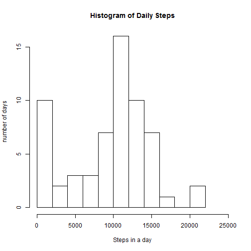
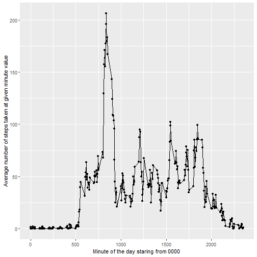
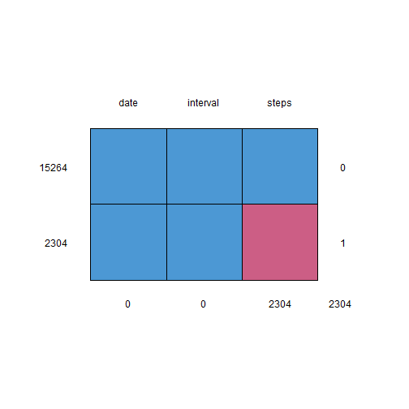
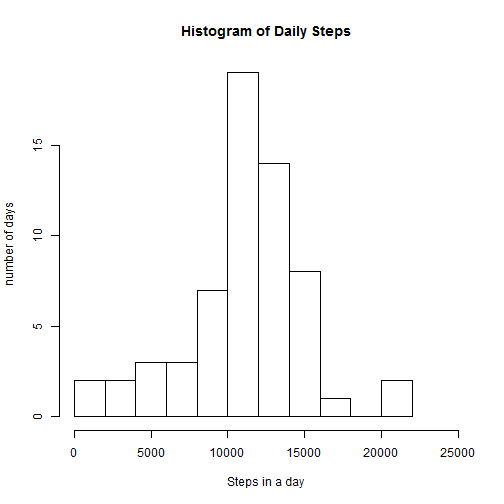
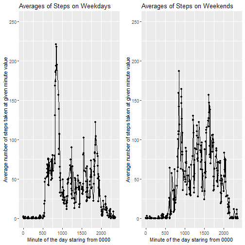

<!---
title: "Week 2 Project 1"
output: html_document
--->

#This is the Assignment for week 2
<br>

####To begin I set the working directory and import some of the first necessary libraries -->

```r
setwd("C:/Users/Rick/Desktop/R_Class5/week2")
library(dplyr)
library(ggplot2)
```
<br>

####The first task is to import the dataframe and to create the histogram with regards to number of steps taken in each day  -->  

```r
data <- read.csv("C:/Users/Rick/Desktop/R_Class5/week2/activity.csv")
DF_StepsByDate = data %>%
  group_by(date) %>%
  summarize(Total.Daily.Steps = sum(steps, na.rm=TRUE))
hist (DF_StepsByDate$Total.Daily.Steps, breaks =  15, xlim = c(0, 25000), xlab = "Steps in a day", ylab = "number of days", main = "Histogram of Daily Steps") 
```


<br>

####The second task is to calculate the mean and median values for steps taken in a day -->
#####The mean value:

```r
mean(DF_StepsByDate$Total.Daily.Steps, na.rm = TRUE)
```

```
## [1] 9354.23
```
<br>

#####The median value:

```r
median(DF_StepsByDate$Total.Daily.Steps, na.rm = TRUE)
```

```
## [1] 10395
```
<br>

####The third task is to create a time series plot of average steps in an interval -->

```r
DF_MaxIntervalSteps = data%>%
  group_by(interval) %>%
  summarize(Max.Steps.Interval = mean(steps, na.rm=TRUE))
ggplot(DF_MaxIntervalSteps, aes(interval, Max.Steps.Interval)) +geom_point()+geom_line()+xlab("Minute of the day staring from 0000")+ylab("Average number of steps taken at given minute value")
```


<br>

####The fourth task was to find which interval saw the most steps taken on average -->

```r
DF_MaxIntervalSteps = data%>%
  group_by(interval) %>%
  summarize(Average.Steps.Per.Interval = mean(steps, na.rm=TRUE))
filter(DF_MaxIntervalSteps, Average.Steps.Per.Interval == max(DF_MaxIntervalSteps$Average.Steps.Per.Interval))
```

```
## # A tibble: 1 x 2
##   interval Average.Steps.Per.Interval
##      <int>                      <dbl>
## 1      835                       206.
```
#####One can see the interval with highest average steps in the interval column of the table.
<br>

####The fifth task is to give code to describe and show strategy for inputing missing data -->

```r
##There are several packages designed to help visualize and input missing data.  Install and load such a library.  I chose mice after exploring some common options. 
library(mice)
```


```r
## the md.pattern function from mice will help you visualize the missing values
md.pattern(data)
```



```
##       date interval steps     
## 15264    1        1     1    0
## 2304     1        1     0    1
##          0        0  2304 2304
```
<br>
\newline The above tables communicate that 15264 rows have no missing values while 2304 rows are missing values in the steps column.  It is clear from the tables that neither the date nor interval columns have any missing values. 
<br>


```r
## First is to initialize helpful variables that will be used with the function to impute values that are random yet likely given other variables and their related factors. 
init = mice (data, maxit=0)
meth = init$method
predMtrx = init$predictorMatrix
predMtrx[ ,c("date")]=0  ## I remove date as an imputation predictor given that I am curious about steps in an interval on an average or normal day, not a specific date.
imputedD = mice(data, method = meth, predictorMatrix = predMtrx, m = 5, seed = 500)
```

```
## 
##  iter imp variable
##   1   1  steps
##   1   2  steps
##   1   3  steps
##   1   4  steps
##   1   5  steps
##   2   1  steps
##   2   2  steps
##   2   3  steps
##   2   4  steps
##   2   5  steps
##   3   1  steps
##   3   2  steps
##   3   3  steps
##   3   4  steps
##   3   5  steps
##   4   1  steps
##   4   2  steps
##   4   3  steps
##   4   4  steps
##   4   5  steps
##   5   1  steps
##   5   2  steps
##   5   3  steps
##   5   4  steps
##   5   5  steps
```

```r
imputedComplete = complete(imputedD)
```
<br>

\newline New dataframe complete with imputed values can be fed into similar code as earlier to produce a histogram of average steps taken in a day. 

```r
DF_StepsByDay = imputedComplete%>%
   group_by(date) %>%
   summarize(Total.Steps.Per.Day = sum(steps))
hist(DF_StepsByDay$Total.Steps.Per.Day, breaks =  15, xlim = c(0, 25000), xlab = "Steps in a day", ylab = "number of days", main = "Histogram of Daily Steps")
```


<br>

####The last task is to create a panel plot comparing average interval steps on weekdays vs weekend days -->

```r
##Import the libraries required for the task of separating data by weekday and to easily organize ggplots into panels
library(timeDate)
library(gridExtra)
```


```r
dataByDate <- imputedComplete
dataByDate$date <- as.Date(dataByDate$date) 
workWeek<- c('Monday', 'Tuesday', 'Wednesday', 'Thursday', 'Friday')
dataByDate$wrkDays <- factor((weekdays(dataByDate$date) %in% workWeek), levels = c(FALSE, TRUE))
'%!in%' <- Negate('%in%')
dataByDate$wkndDays <- factor((weekdays(dataByDate$date) %!in% workWeek), levels = c(FALSE, TRUE))
weekendData <- dataByDate[dataByDate$wkndDays == TRUE, ]
weekdayData <- dataByDate[dataByDate$wrkDays ==TRUE, ]

weekdayStepsByInterval = weekdayData%>%
  group_by(interval) %>%
  summarize(Max.Steps.Interval = mean(steps, na.rm=TRUE))
plot1 <- ggplot(weekdayStepsByInterval, aes(interval, Max.Steps.Interval)) +geom_point()+geom_line()+xlab("Minute of the day staring from 0000")+ylab("Average number of steps taken at given minute value")+ ggtitle("Averages of Steps on Weekdays")+ ylim(0,250)

weekendStepsByInterval = weekendData%>%
  group_by(interval) %>%
  summarize(Max.Steps.Interval = mean(steps, na.rm=TRUE))
plot2 <- ggplot(weekendStepsByInterval, aes(interval, Max.Steps.Interval)) +geom_point()+geom_line()+xlab("Minute of the day staring from 0000")+ylab("Average number of steps taken at given minute value")+ ggtitle("Averages of Steps on Weekends")+ylim(0,250)

grid.arrange(plot1, plot2, nrow = 1)
```



